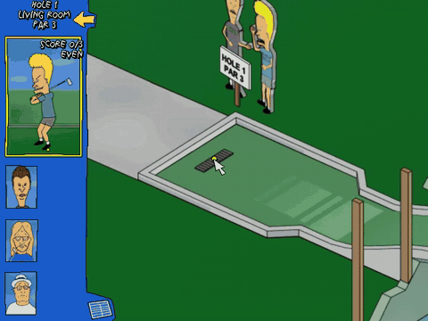
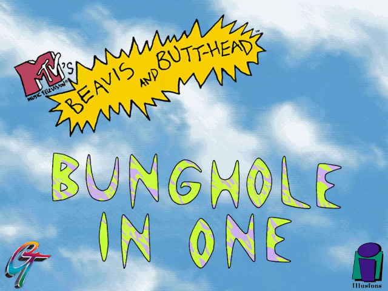
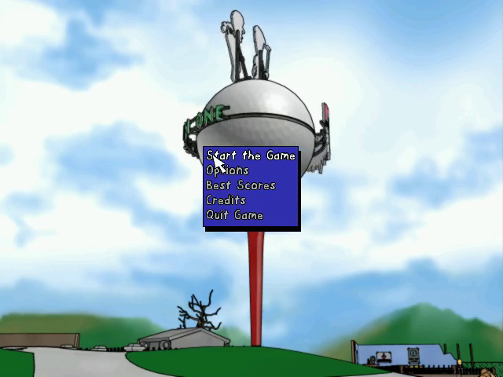
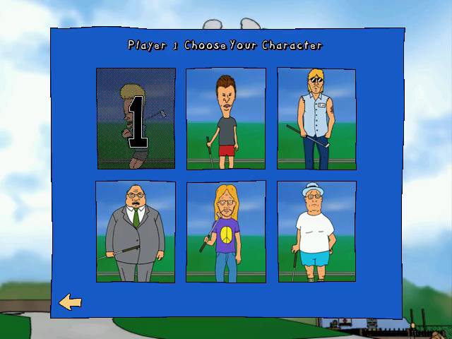
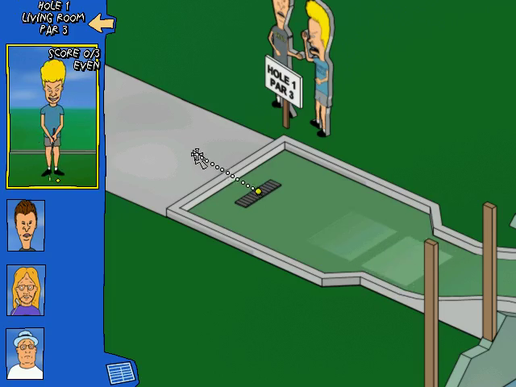
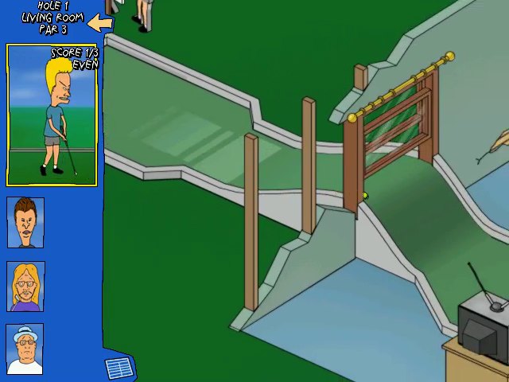

# Bunghole in One — Static Recompilation



Static recompilation of **MTV's Beavis and Butt-Head: Bunghole in One**
(The Illusions Gaming Company / GT Interactive, 1998), a Windows 95 mini-golf
game, from its shipping Win32 executables to native C.

Built on the [pcrecomp](https://github.com/sp00nznet/pcrecomp) toolchain and
following its shared house style (layout, CLI, conformance harness, headless
mode).

## Status: **v0.1.0-dev, alpha. Plays: menus, character select, hole 1, a putt that rolls. Only the first putt of the first hole has been checked.**

| Stage | State |
|---|---|
| P0: identify the binaries | done: `GOLF.EXE` (engine, 244 exports) + `00170001.DLL` (game module, imports 93 of them back), MSVC 5, no protection |
| Function catalog (`disasm32`) | 1,210 + 698 functions |
| Lift (`run_lift.py`) | **whole program**: 1,944 functions, 0 lift errors, 433K lines of C |
| Host (`build/bunghole.exe`, 32-bit, pcrecomp `native32`) | runs both lifted modules together; 183 imports bound to real Windows, the DLL's 93 bound to the lifted engine |
| DirectDraw | `softdd`: a software DirectDraw in the host. The game never touches the real display mode ([host.md](docs/host.md)) |
| Intro videos (DirectShow) | **play**: native DirectShow decodes into softdd surfaces |
| Main menu | **reached**, headless, about 70 s in (the intros run in real time) |
| Gameplay | **hole 1 plays**: player count, character select, the fly-through, the aim line, a putt, the ball rolling with the camera following. Nothing after the first putt has been checked ([ROADMAP.md](ROADMAP.md)) |
| Headless mode | `--headless --record out.mp4`, with `--click` / `--drag` for scripted input |
| Windowed mode | runs (1,900 frames on an offstage virtual monitor); no picture of the window yet |
| Conformance harness | **18/18 milestones** (12 boot, 6 play including "the ball moved": 76% of the screen changes after the putt), 0 lift errors ([tools/conformance.py](tools/conformance.py)) |

The six toolkit changes this needed are open pcrecomp PRs, #16 to #20 on top
of #7 ([docs/toolkit.md](docs/toolkit.md)). Until they merge, build against a
pcrecomp checkout that has them.

## Screenshots

Real output of `build\bunghole.exe --headless --record`, recompiled code
throughout:

| | |
|---|---|
|  |  |
|  |  |
|  |  |

## What is not in this repo

Nothing from the game: no executables, no data, no disc image, and **no
generated source**. The recompiled C is produced on your machine from your own
copy by `run_lift.py`, into `src/recomp/gen/`, which is gitignored. The tool
ships; its output never does.

## Getting Started

You need **your own copy of Bunghole in One**: the CD, or a BIN/CUE or ISO
made from it. Nothing is downloaded for you.

### Quick start

1. Download this repository (the green **Code** button, then **Download ZIP**)
   and unzip it somewhere with 2 GB free.
2. Double-click **`Setup.cmd`**.

It checks for Python 3.10+, the `pefile` and `capstone` packages, the pcrecomp
toolkit and the Visual Studio 2022 C++ compiler, and **asks** before installing
any of them, saying what and how big. It finds the CD in your drives, or asks
where the game is (a drive, a folder, or a `.cue`/`.bin`/`.iso`). Then it
copies the disc's files into `game\disc`, finds every function, recompiles
both executables and builds `build\bunghole.exe`. A rerun skips the finished
steps. If it stops, it says why in one sentence, and the details are in
`setup.log`.

It ends with a **`Bunghole in One`** shortcut in the folder. Double-click it to
play.

### Step by step

Prerequisites: Windows 10/11, **Python 3.10+** (`py -3 --version`), **git**,
**Visual Studio 2022** (or its Build Tools) with *Desktop development with
C++*, and the pcrecomp toolkit cloned **beside** this repository as `tools`:

```
some-folder\
  tools\                        <- git clone https://github.com/sp00nznet/pcrecomp tools
  bunghole\                     <- git clone https://github.com/sp00nznet/bunghole
```

1. Python packages:
   ```
   py -3 -m pip install --user pefile capstone
   ```
2. Your CD's files into `game\disc` (from the drive, a folder, or an image):
   ```
   py -3 tools\disc.py E:\
   py -3 tools\disc.py path\to\BUILD_12.cue
   ```
   Expected: `reading 754 files, 344 MB, from ...` then `done: ...\game\disc`.
3. Function catalogs for both executables (half a minute):
   ```
   py -3 tools\catalog.py
   ```
   Expected, among the progress lines: `Functions: 1210` for `GOLF.EXE` and
   `Functions: 698` for `00170001.DLL`.
4. Recompile to C:
   ```
   py -3 run_lift.py
   ```
   Expected:
   ```
   [*] GOLF.EXE: base=0x00400000 code=0x00401000-0x00427600 IAT=143 catalog=1210
   [*] 00170001.DLL: base=0x10000000 code=0x10001000-0x1001BE00 IAT=154 catalog=698
   ============================================================
     lifted 1944   errors 0   no terminator 3
   ```
5. Build (the 64-bit-hosted MSVC targeting x86, CMake and Ninja; all three come
   with the C++ workload):
   ```
   build.cmd
   ```
   Expected: `Linking C executable bunghole.exe`.
6. Check it without opening a window:
   ```
   build\bunghole.exe
   ```
   Expected: `[bind] 0x10000000: 55 native, 93 guest, 6 shimmed, 0 unresolved`
   and `(dry run: images mapped and bound; --run enters 0x0041D2D0)`.

The usual trip-ups: `python` opening the Microsoft Store (that is Windows' alias
placeholder; use `py -3`, or turn the alias off in *Settings > Apps > Advanced
app settings > App execution aliases*); a freshly installed Python not being on
`PATH` until you open a new window; and a pcrecomp too old for `native32`'s
guest modules (`git -C ..\tools pull`).

## Usage

```
build\bunghole.exe --run --scale 2                          # play, in a 1280x960 window
build\bunghole.exe --run --headless --record out.mp4        # no window: record what it draws
build\bunghole.exe --run --headless --frames 2000 --record menu.mp4   # stop at the menu
build\bunghole.exe --run --headless --watchdog 60 --native-trace      # every Windows call
py -3 tools\conformance.py                                  # boot and play milestones, vs the baseline
```

Hole 1 and one putt, headless (what the conformance run does):

```
build\bunghole.exe --run --headless --record putt.mp4 --frames 6800 ^
    --click 318,198@2050 --click 200,237@2400 --click 192,168@2900 ^
    --drag 320,238,-80,-50@5000
```

| Flag | |
|---|---|
| `--run` | enter the game (without it: map, bind and stop) |
| `--headless` | no window reaches the screen; message boxes go to stderr |
| `--record out.mp4` | pipe every presented frame to ffmpeg (30 fps, wall-clock paced) |
| `--frames N` | exit after N presented frames |
| `--scale N` | windowed client area is 640x480 times N |
| `--click X,Y@F` | at frame F, click at (X,Y) in the game's 640x480 |
| `--drag X,Y,DX,DY@F` | at frame F, press at (X,Y), drag by (DX,DY), release: a putt goes the opposite way |
| `--call VA ARGS...` | run one lifted function on the given dwords and print eax and st(0); no boot |
| `--game DIR` | the CD's files (default `game\disc`) |
| `--watchdog S` | stop after S seconds and say where the game was |
| `--native-trace`, `--callbacks` | one line per call into Windows, or back from it |

## Building from source

Steps 3 to 5 above. `PCRECOMP` (Python) and `-DPCRECOMP=` (CMake, through
`set CMAKE_ARGS=...` for `build.cmd`) point at a toolkit checkout other than
`..\tools`; the lifter and the runtime must come from the same tree. How the
pieces fit is [docs/architecture.md](docs/architecture.md).

## License

MIT, for the code in this repository ([LICENSE](LICENSE)). Bunghole in One
itself is © 1998 GT Interactive Software / The Illusions Gaming Company, and
Beavis and Butt-Head are © MTV Networks; none of it is here.
